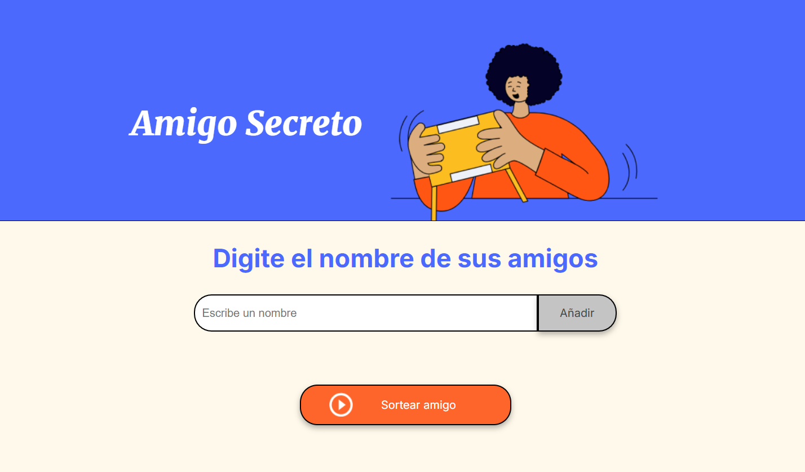
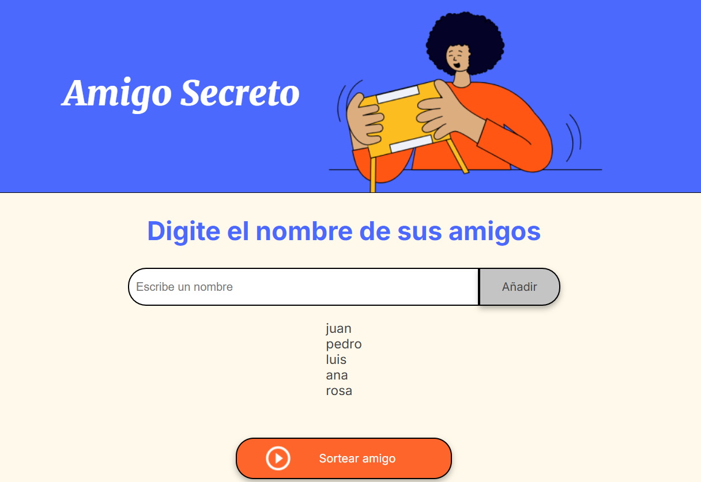
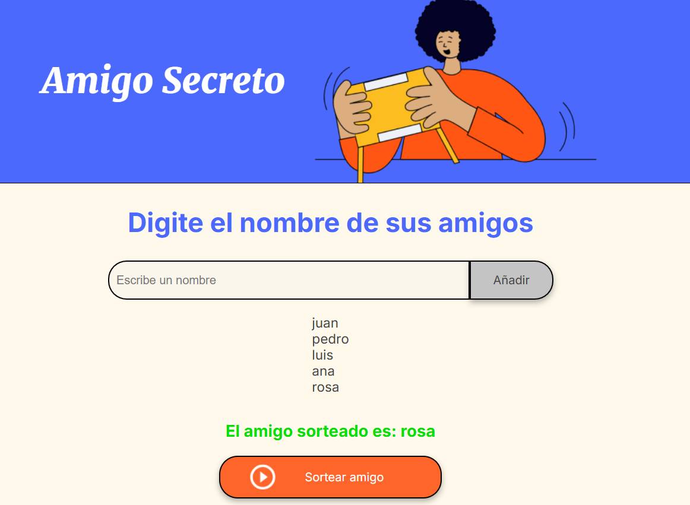
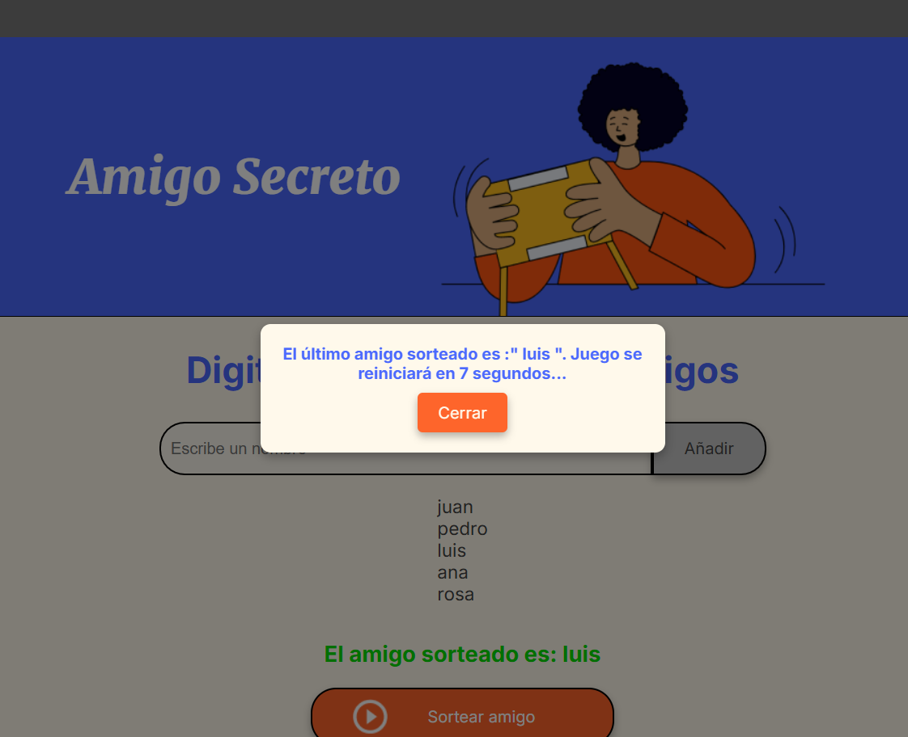

<h1> Challenge Amigo Secreto</h1>
- Estado : En construción.

📌 Amigo Secreto
Un pequeño proyecto web interactivo para realizar sorteos de amigo secreto de manera sencilla y divertida. 🏆🎁

📖 Descripción
Juego que permite a los usuarios agregar nombres de amigos y realizar un sorteo aleatorio para determinar quién es su amigo secreto. Incluye un diseño atractivo, validaciones y mensajes de alerta para mejorar la experiencia del usuario.

🚀 Características
✅ Agregar amigos a la lista.
✅ Evitar nombres duplicados.
✅ Sortear aleatoriamente los amigos.
✅ Evitar agregar amigos una vez iniciado el sorteo.
✅ Reiniciar automáticamente el sorteo al finalizar.

🛠️ Tecnologías Utilizadas
HTML5 – Estructura de la página.
CSS3 – Estilos y diseño responsivo.
JavaScript – Lógica del sorteo y validaciones.

📂 Estructura del Proyecto
bash
Copiar
Editar
/amigo-secreto
│── assets/                     # Imágenes e íconos
│── app.js                      # Código JavaScript
│── index.html                  # Página principal
│── README.md                   # Documentación del proyecto
│── style.css                   # Estilos CSS

📋 Requisitos Previos
Para ejecutar este proyecto, solo necesitas un navegador web. No se requieren dependencias adicionales.

📌 Uso del Proyecto
1️⃣ Abrir el archivo index.html en tu navegador.
2️⃣ Ingresar nombres en el campo de texto y presionar "Añadir".
3️⃣ Realizar el sorteo presionando el botón "Sortear amigo".
4️⃣ Ver los resultados en la lista.
5️⃣ Esperar la limpieza automática de la lista tras sortear a todos los amigos.

📷 Capturas de Pantalla

### 🔹 Pantalla principal

### 🔹 Ingreso de nombres

### 🔹 Sorteo en proceso

### 🔹 Reinicio del sorteo

📝 Autor
👤 [Ed]
📧 Contacto: [edpsx2@gmail.com]
💼 GitHub: [https://github.com/eD07]